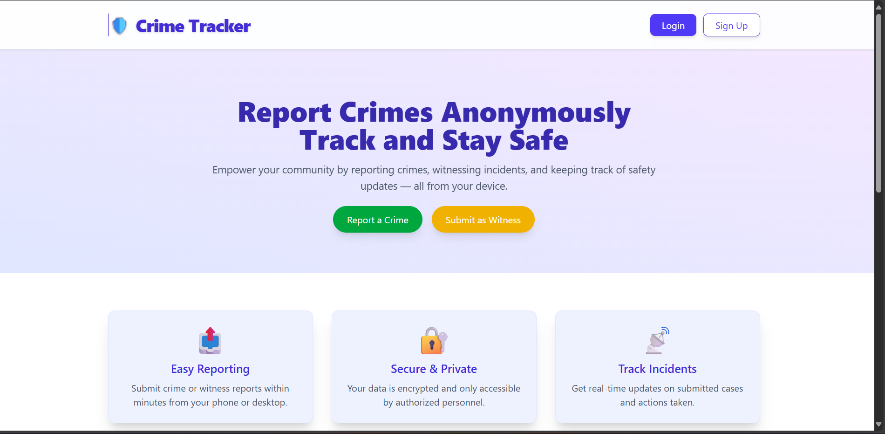
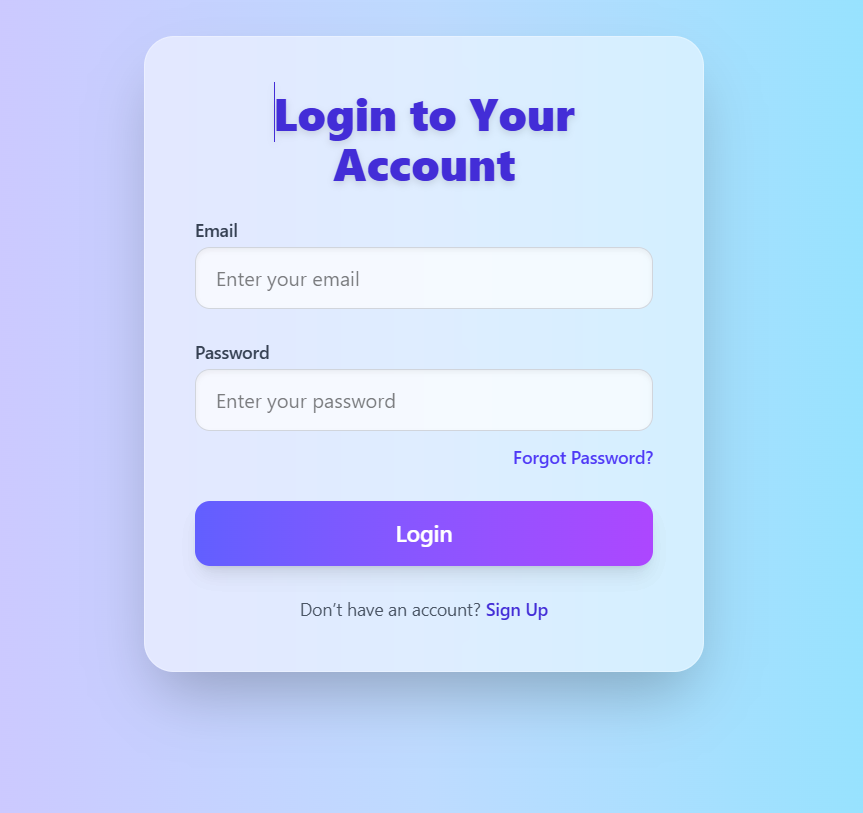
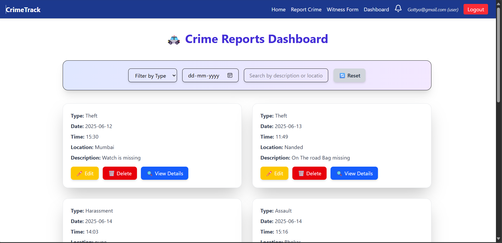
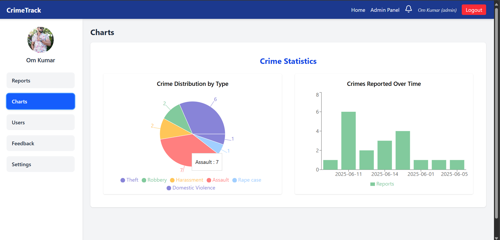
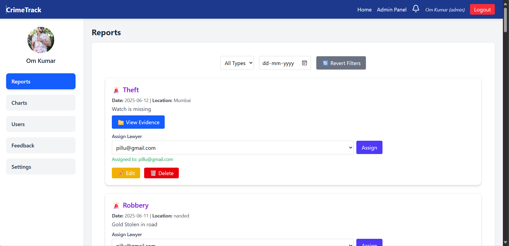
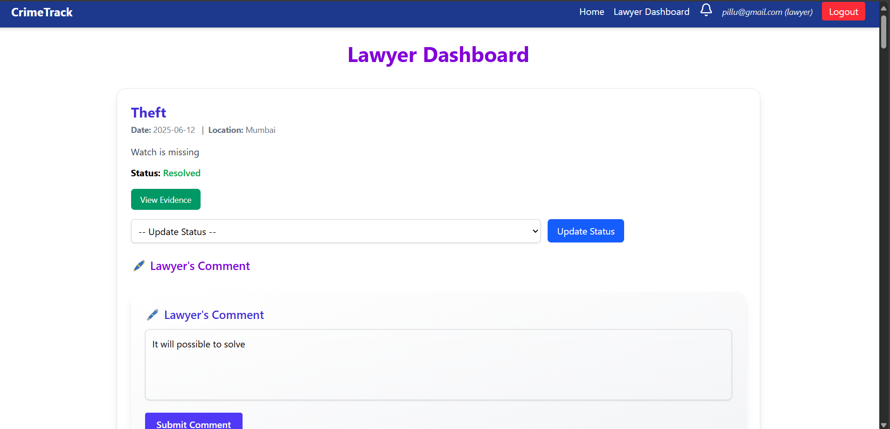

# 🚨 Crime Report App (CrimeTrack)

A full-stack web application built with **React (Vite)** and **Firebase**, designed for reporting crimes, legal case tracking, and coordinated communication among **users**, **lawyers**, and **admins**.

---

## 🌐 Live Demo

[👉 Click here to view the live app](https://crimetracke.netlify.app/)  


---

## 📸 Screenshots

**Landing Page (Before Login)**  


**Register Page**  


**Login Page**  


**Home Page & Dashboard (User View)**  


**Admin Dashboard with Charts & Management Tools**  


**Admin Reports – Assign Lawyers to Cases**  


**Lawyer Dashboard – Add Evidence & Comments**  


---

## 📁 Project Structure

```
crime-report-app/
│
├── node_modules/                 # Auto-installed dependencies
├── public/                       # Public assets and index.html
├── server/                       # Server/backend logic (if any)
│
├── src/                          # Frontend source code
│   ├── assets/
│   │   └── screenshoots/         # All README screenshots
│   │       ├── admin-charts.png
│   │       ├── admin-reports.png
│   │       ├── landing-page.png
│   │       ├── lawyer-dashboard.png
│   │       ├── login.png
│   │       ├── register.png
│   │       └── user-dashboard.png
│   │
│   ├── components/               # Reusable UI components
│   │   ├── ChartPannel.jsx
│   │   ├── FeedbackForm.jsx
│   │   ├── FeedbackPannel.jsx
│   │   ├── HearingTimeline.jsx
│   │   ├── LawyerCommentForm.jsx
│   │   ├── Navbar.jsx
│   │   ├── NotificationBell.jsx
│   │   ├── PrivateRoute.jsx
│   │   ├── ProtectedRoute.jsx
│   │   ├── ReportPannel.jsx
│   │   ├── SettingPannel.jsx
│   │   └── UserPannel.jsx
│   │
│   ├── pages/
│   │   ├── AdminDashboard.jsx
│   │   ├── CaseDetails.jsx
│   │   ├── Dashboard.jsx
│   │   ├── Home.jsx
│   │   ├── LawyerDashboard.jsx
│   │   ├── Login.jsx
│   │   ├── NotificationPannel.jsx
│   │   ├── Register.jsx
│   │   ├── ReportCrime.jsx
│   │   └── WitnessForm.jsx
│   │
│   ├── services/
│   │   ├── cloudinary.js
│   │   └── firebase.js
│   │
│   ├── utils/
│   │   ├── aiUtils.js
│   │   ├── analyzeComplexity.js
│   │   └── notification.js
│   │
│   ├── App.jsx
│   ├── main.jsx
│   ├── App.css
│   └── index.css
│
├── .gitignore
├── eslint.config.js
├── index.html
├── package.json
├── package-lock.json
├── vite.config.js
└── README.md
```

---

## 🧪 Features

- ✅ User sign-up/login via Firebase Auth  
- 📝 Submit crime reports with form validation  
- 🧑‍⚖️ Lawyers can review cases, upload files, add comments  
- 👮 Admin panel with case assignment, charts & timelines  
- 🔔 Real-time notifications (Firestore)  
- 🧾 Feedback & witness submission forms  
- 🛡️ Route protection based on roles (user, lawyer, admin)

---

## 🛠️ Tech Stack

| Frontend       | Backend/Auth         | File Upload                 | Charting            |
|----------------|----------------------|-----------------------------|---------------------|
| React + Vite   | Firebase Auth + Firestore | Firebase Storage, Cloudinary | Chart.js / Recharts |

---

## 🚀 Getting Started

### 1. Clone the repository

```bash
git clone https://github.com/your-username/crime-report-app.git
cd crime-report-app
```

### 2. Install dependencies

```bash
npm install
```

### 3. Firebase setup

- Create a Firebase project  
- Enable Email/Password Auth, Firestore, and Storage  
- Copy config to `src/services/firebase.js`

### 4. (Optional) Cloudinary setup

- Create an account at [Cloudinary](https://cloudinary.com/)  
- Add credentials to `src/services/cloudinary.js`

### 5. Run the app locally

```bash
npm run dev
```

Open [http://localhost:5173](http://localhost:5173) to view it in the browser.

---

## ⚙️ Firebase Setup (`src/services/firebase.js`)

```js
import { initializeApp } from "firebase/app";
import { getAuth } from "firebase/auth";
import { getFirestore } from "firebase/firestore";
import { getStorage } from "firebase/storage";

const firebaseConfig = {
  apiKey: "YOUR_API_KEY",
  authDomain: "YOUR_PROJECT.firebaseapp.com",
  projectId: "YOUR_PROJECT",
  storageBucket: "YOUR_BUCKET.appspot.com",
  messagingSenderId: "SENDER_ID",
  appId: "APP_ID",
};

const app = initializeApp(firebaseConfig);
export const auth = getAuth(app);
export const db = getFirestore(app);
export const storage = getStorage(app);
```

---

## ☁️ Cloudinary Setup (`src/services/cloudinary.js`)

```js
export const uploadToCloudinary = async (file) => {
  const formData = new FormData();
  formData.append("file", file);
  formData.append("upload_preset", "YOUR_UPLOAD_PRESET");

  const res = await fetch(
    "https://api.cloudinary.com/v1_1/YOUR_CLOUD_NAME/image/upload",
    {
      method: "POST",
      body: formData,
    }
  );

  const data = await res.json();
  return data.secure_url;
};
```

---

## 🔐 Tips

- Set Firestore **security rules** to restrict access based on roles
- Store sensitive keys like Firebase in a `.env` file
- Deploy on **Netlify**, **Vercel**, or **Firebase Hosting**

---

## 🤝 Contributing

1. Fork the repository  
2. Create a branch: `git checkout -b feature/feature-name`  
3. Commit your changes: `git commit -m "feat: your message"`  
4. Push to your branch: `git push origin feature/feature-name`  
5. Submit a Pull Request


